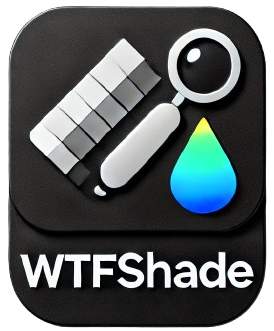
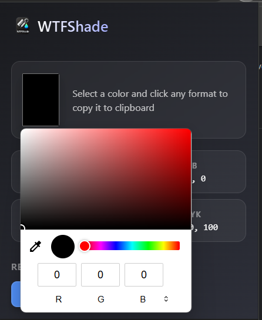
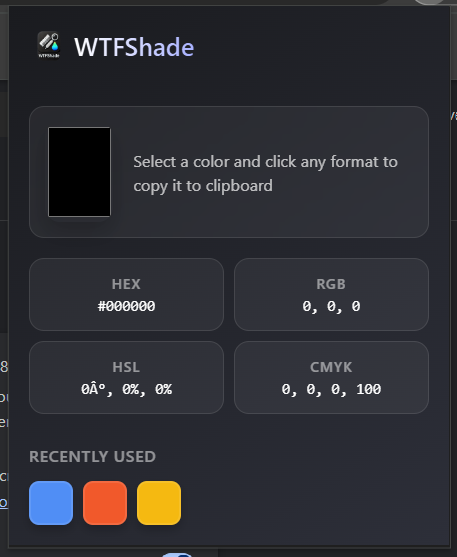

# WTFShade 🎨

A sleek color picker Chrome extension with instant HEX, RGB, HSL, and CMYK format copying. Features a modern dark UI and color history tracking.

  

## ⚡ Quick Install

1. [Download the latest release]([https://github.com/RashminaFdo/WTFShade/])
2. Unzip the downloaded file
3. Open Chrome and go to `chrome://extensions/`
4. Enable "Developer mode" (top right)
5. Click "Load unpacked" and select the unzipped folder

## 🎨 Features

- Modern dark-themed interface
- Copy colors in multiple formats:
  - HEX (#FFFFFF)
  - RGB (255, 255, 255)
  - HSL (0°, 0%, 100%)
  - CMYK (0%, 0%, 0%, 0%)
- Automatic color history tracking
- One-click copy to clipboard
- Lightweight and fast

## 📸 Screenshots

## 🚀 How to Use

1. Click the WTFShade icon in your Chrome toolbar
2. Use the color picker to select a color
3. Click any format (HEX, RGB, HSL, CMYK) to copy it
4. Previously used colors appear in the history section

## 🛠️ Tech Stack

- Vanilla JavaScript
- HTML/CSS
- Chrome Extension APIs

## 📝 License

MIT License - feel free to use and modify!

## 🤝 Contributing

Feel free to open issues and pull requests!

## 👩‍💻 Author

**Rashmina Fernando**

- Portfolio: [rashminafdo.github.io/Portfolio](https://rashminafdo.github.io/Portfolio/)
- GitHub: [@RashminaFdo](https://github.com/RashminaFdo)

---

  Made with ❤️ by <a href="https://rashminafdo.github.io/Portfolio/">Rashmina Fernando</a>

